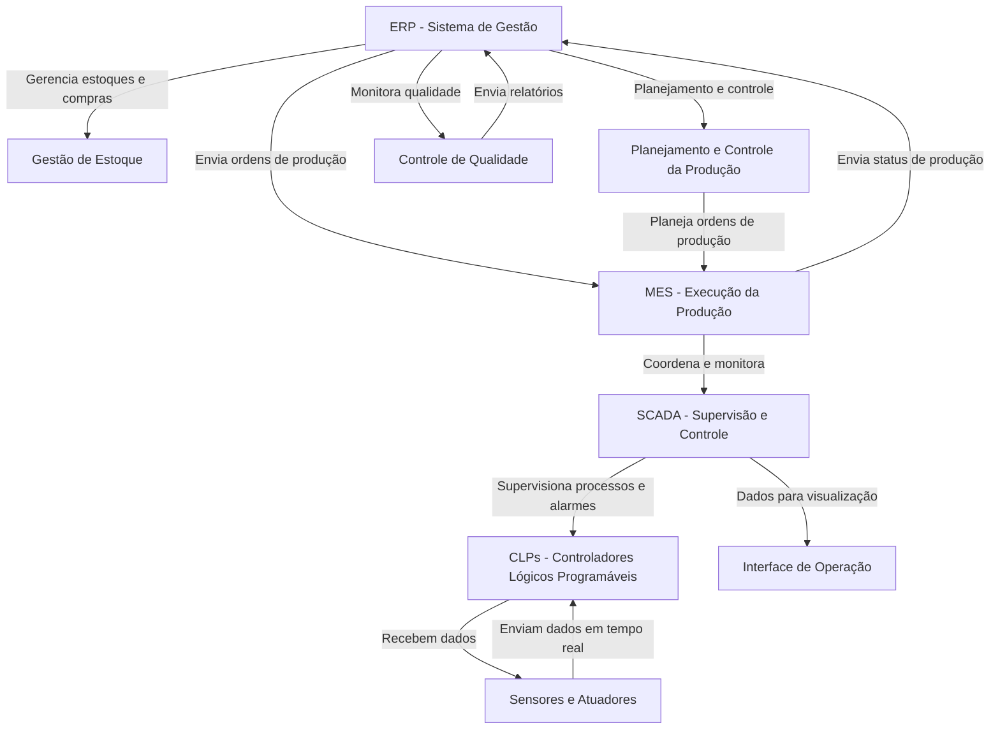

#  🏭 Levantamento de Módulos e Integrações na Indústria 4.0

> **Projeto desenvolvido por:** 
> 🧑‍💻 Juan Pablo 
> 🧑‍💻 Vinicius Pires
> 🧑‍💻 Luís Henrique
> 🧑‍💻 Daniel

## 📌 1. Identificação dos Módulos do ERP

Para garantir a gestão eficiente da empresa, os seguintes módulos do ERP são necessários:

- ✅ **Compras**: Controle de aquisições de matérias-primas e insumos.
- ✅ **PCP (Planejamento e Controle da Produção)**: Geração e controle de Ordens de Produção (OPs).
-✅  **Manutenção**: Gerenciamento preventivo e corretivo de máquinas e equipamentos.
- ✅ **Controle de Qualidade**: Monitoramento da qualidade dos produtos e processos.
- ✅ **Estoque**: Controle de entrada e saída de matérias-primas e produtos acabados.
- ✅ **Financeiro**: Gestão de custos, faturamento e fluxo de caixa.
- ✅ **Vendas e Distribuição**: Processamento de pedidos e gestão logística.

## 🔗 2. Integração com o MES

Para otimizar a execução das ordens de produção e garantir rastreabilidade, as seguintes informações são trocadas entre o ERP e o MES:

- ➡️ **Do ERP para o MES**: Ordens de produção, planejamento de materiais, dados de estoque.
- ⬅️ **Do MES para o ERP**: Status de produção, consumo de matérias-primas, informações de qualidade.

Essa integração permite a sincronização entre planejamento estratégico e execução operacional.

## ⚡ 3. SCADA e Controle de Processos

O SCADA será integrado ao MES e aos CLPs da seguinte forma:

- **SCADA para MES**: Envio de dados operacionais (temperatura, pressão, velocidade de linha, etc.).
- **MES para SCADA**: Ajustes nos parâmetros de produção com base em ordens de produção.
- **SCADA para CLPs**: Comandos de controle em tempo real para máquinas e equipamentos.

Essa comunicação garante a supervisão em tempo real, detecção de falhas e otimização do processo produtivo.

## 4. Sensores e Atuadores

Os sensores e atuadores coletam dados essenciais para automação e controle. Os principais são:

- **Sensores de temperatura e pressão**: Monitoramento de condições ambientais.
- **Sensores de posição e velocidade**: Controle de esteiras transportadoras e robôs.
- **Sensores de qualidade**: Detecção de defeitos e medidas de precisão.
- **Atuadores pneumáticos e elétricos**: Controle de movimentação e execução de tarefas.

Essas informações são utilizadas para garantir controle de qualidade, rastreabilidade e eficiência operacional.

## 5. Integração Horizontal e Vertical

A conexão entre os sistemas da fábrica segue o modelo da **Pirâmide da Automação**:

### **Integração Vertical**

Garante fluxo de informações entre os níveis estratégico, tático e operacional.

### **Integração Horizontal**

- **ERP ➔ Fornecedores e Clientes**
- **SCADA ➔ Linhas de Produção e Logística**

Sincroniza processos internos e externos, garantindo eficiência produtiva.

## 6. Desafios e Benefícios da Integração

### **Desafios**:

- Complexidade na implementação e configuração dos sistemas.
- Necessidade de padronização dos protocolos de comunicação.
- Alto investimento inicial para digitalização e modernização.
- Integração de sistemas legados com novas tecnologias.

### **Benefícios**:

- Maior eficiência produtiva e redução de desperdícios.
- Melhor rastreabilidade e controle de qualidade.
- Supervisão em tempo real e tomada de decisão baseada em dados.
- Integração entre setores internos e com parceiros externos.

## 7. Conclusão

A integração entre **ERP, MES, SCADA, CLPs e sensores/atuadores** é essencial para maximizar a eficiência e competitividade na **Indústria 4.0**. A implementação bem planejada desses sistemas permite um **controle mais preciso da produção**, **melhor gestão de recursos** e **maior flexibilidade para adaptação a novas demandas do mercado**.

